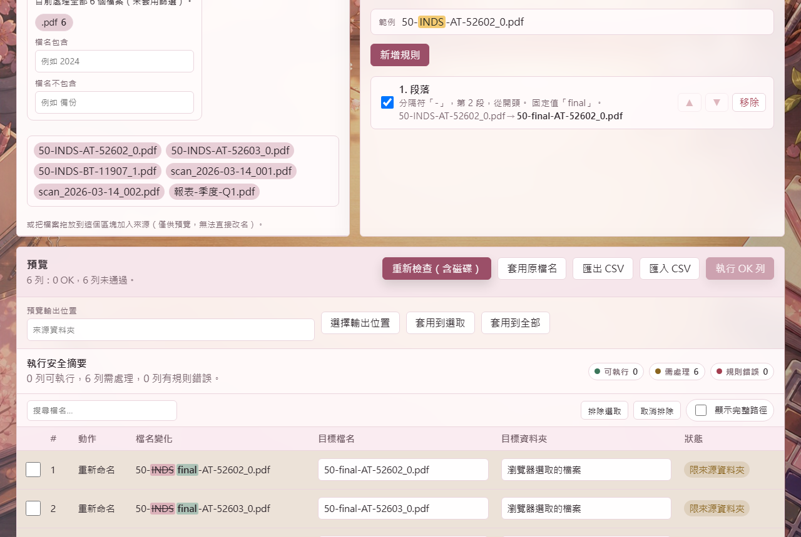

# Batch File Renamer PWA

**繁體中文** | [English](README.en.md) | [日本語](README.ja.md)

一個先預覽、再執行的批次檔名工具。  
它把舊版 PowerShell 工具重構成靜態 PWA，保留本機檔案操作能力，同時把風險最高的「直接改檔名」變成可檢查、可理解、可回頭確認的流程。

## 畫面

> 實機截圖，載入 6 個示範檔案後拍攝。



這是整個工具的重點：**按下執行之前，每一列都先攤開來看**。
檔名變化用刪除線標出被改掉的部分，右側是每列的狀態，
上方「執行安全摘要」把可執行 / 需處理 / 規則錯誤的列數分開統計——
截圖中 6 列都是「限來源資料夾」，因為這批檔案是用檔案選擇器加入的，只有預覽權限。


規則由上到下套用，每條規則即時顯示自己的效果（`50-INDS-AT-52602_0.pdf → 50-final-AT-52602_0.pdf`），
不用執行就知道會發生什麼。

## 立即使用

Live App: https://yoyocadence.github.io/Batch-file-renamer/

適合這些情境：

- 一次整理大量照片、PDF、掃描檔、輸出報表。
- 依照段落、字元範圍、固定文字、序號或清單重組檔名。
- 先看每一列預覽，再只執行狀態為 OK 的列。
- 複製同一個模板檔案到指定資料夾，並自動產生不同檔名。

## 為什麼用起來比較安心

批次改名最可怕的不是功能不夠，而是按下去之前不知道會發生什麼。這個工具把主要決策放在畫面上：

- **一開始就說清楚能不能改**：載入檔案後立刻顯示「可直接改檔名」或「僅預覽」，不會等你建好規則才發現整批不能執行。
- **看得出改了什麼**：預覽表格用行內標色顯示被取代與新增的片段，不必用眼睛比對兩欄檔名。
- **邊調邊看**：改規則時預覽自動更新，每張規則卡也會顯示自己的 before → after。
- **只執行 OK**：警告、錯誤、重複、無變更等列不會被混在同一個按鈕裡偷偷執行。
- **被擋下時知道怎麼辦**：每個問題列附上人話原因，可機械修復的還有一鍵修正。
- **明確模式**：重新命名是在原地改名；複製是把模板檔案複製到輸出資料夾後改名。
- **系統檔過濾**：載入來源時會略過 `desktop.ini`、`Thumbs.db` 等常見系統或暫存檔。

## 核心功能

**選擇要處理哪些檔案**

- 本機資料夾重新命名，支援 Chromium 的 File System Access API。
- 處理範圍篩選：副檔名 chips（附命中數）、檔名包含／不包含，並用一句話說明目前的篩選條件。
- 被篩掉的檔案仍留在清單中並變灰，看得出是「被排除」而不是「消失了」。

**決定檔名怎麼改**

- 新手規則：加前綴／後綴、改副檔名、清理（整理空白、空白換底線、移除特殊字元、合併重複分隔符）。
- 進階規則：段落、字元範圍、尋找取代（可用正規表達式）、大小寫轉換。
- 值模式：固定值（支援 `{yyyy-MM-dd}` 等日期 token）、清單、遞增、遞減、刪除。
- 規則可個別啟用／停用、拖曳排序，每張卡顯示自己的 before → after。
- 規則預設集可命名儲存、載入、刪除；上次用的規則會自動記住。

**確認之後再執行**

- 預覽表格：行內 diff 標色、狀態計數 chip 可點擊篩選、搜尋列、手動編輯目標檔名。
- 一鍵修正：自動加序號、取代非法字元、處理 Windows 保留名稱、去除結尾點與空白。
- 批次排除：勾選後把特定列排除在執行之外。
- 執行後可復原上一批重新命名，並匯出逐列執行記錄 CSV。
- CSV 匯入與匯出，方便人工修表或交叉檢查。

**外觀**

- 介面語言：繁體中文、簡體中文、英文、日文。
- 20+ 高清背景模板與 20+ 主題色，可在設定中即時切換。
- 寵物助手：精緻角色、簡單幾何角色、漫畫泡泡、拖曳反應、合理移動模式。

## 使用流程

1. **選擇來源**：用「選擇來源資料夾」載入才能真的改檔名；「選取檔案」與拖放只能預覽。
2. **縮小範圍**：用副檔名與檔名條件把不該動的檔案排除在外。
3. **建立規則**：由上到下套用，規則卡會即時顯示每一條的效果。
4. **檢查預覽**：預覽會自動更新；按「重新檢查（含磁碟）」會另外偵測輸出資料夾中已存在的同名檔案。
5. **只執行 OK 列**：其餘列不會被動到。

## 寵物系統

目前包含新的 **任意門文件修補師**。它不是單純亂飄，而是用更合理的方式移動：

- 平常在地面或區塊上緣行走。
- 需要換區域時，會使用任意門、竹蜻蜓或繩索作為過場。
- 被拖曳時會切換到慌張表情。
- 對話改成短句陪伴式語氣，避免突然問使用者不能回答的問題。

仍可在設定中切回舊的自由飄移模式。

## 技術架構

這是一個不需要後端的靜態 PWA：

- `pwa/index.html`：主要 UI 結構。
- `pwa/assets/app.js`：應用狀態、檔案選取、處理範圍、即時預覽、執行流程、設定與寵物行為。
- `pwa/assets/rules.js`：檔名規則引擎、範圍篩選、檔名 diff、列修正、CSV 轉換、預覽列驗證。純邏輯，不依賴語系。
- `pwa/assets/settings.js`：語系、模板、主題、寵物設定、規則預設集與上次規則的儲存，以及翻譯字典。
- `pwa/assets/style.css`：響應式版面、主題變數、背景模板、寵物動畫。
- `pwa/service-worker.js`：PWA runtime cache。採 cache-first，因此**任何動到快取檔案的變更都必須 bump `CACHE_NAME`**，否則回訪的使用者不會拿到新版；更新偵測到之後會顯示更新提示。
- `tests/*.test.mjs`：Node test runner 測試規則引擎、i18n、儲存、靜態資產與 UI wiring。
- `tests/e2e/*.spec.mjs`：Playwright 在 Chromium 中實際操作已發布的檔案。

資料保存：

- 不使用後端或資料庫。來源檔案、資料夾權限、預覽列都只存在記憶體中，重新整理就會消失（檔案 handle 無法保存）。
- `localStorage` 只保存三件事：外觀設定、具名規則預設集，以及上次使用的規則／值清單／模式。
- 處理範圍篩選與排除的列刻意不保存，避免被帶到下一個資料夾時靜默改變執行內容。

檔案操作策略：

- 直接重新命名與複製依賴 File System Access API，因此以 Chromium 系瀏覽器體驗最佳。
- 不支援該 API 的瀏覽器仍可使用規則、預覽、CSV 匯入與匯出。
- 瀏覽器的資料夾選擇器是權限視窗，可能只顯示資料夾而不列出內部檔案；要挑特定檔案時請使用「選取檔案」。

## 本機執行

```powershell
py -m http.server 4173 --directory pwa
```

開啟：

```text
http://127.0.0.1:4173/index.html
```

## 驗證

```powershell
npm run test       # 單元與靜態檢查
npm run test:e2e   # Playwright 瀏覽器驗證
```

目前測試涵蓋：

- 規則引擎、範圍篩選、檔名 diff、列修正與預覽列驗證。
- 規則正規化：從儲存讀回的損毀或舊版資料不會弄壞應用。
- 設定、規則預設集與上次規則的儲存往返（含損毀資料與寫入被拒）。
- 四語翻譯鍵一致性。
- 20+ 背景模板與 20+ 主題設定、高清背景素材大小門檻。
- 寵物素材、合理移動 hook、service worker cache 版本。
- 文字檔無 unresolved merge marker。
- Playwright：完整操作流程，包含即時預覽、範圍篩選、diff 與一鍵修正、規則預設集、批次排除、執行與復原。

## 部署

GitHub Pages 由 `.github/workflows/pages.yml` 在推送到 `main` 時部署。

PWA 會在背景檢查新版 service worker。偵測到新版本時，畫面底部會出現更新提示；按下「立即更新」後會切換到最新 cache 並重新載入頁面。

部署網址：

https://yoyocadence.github.io/Batch-file-renamer/

## 舊版來源

原始 PowerShell 壓縮檔保留在 `legacy/batch_file_renamer_v4/`，行為盤點記錄在 `docs/legacy-audit.md`。
